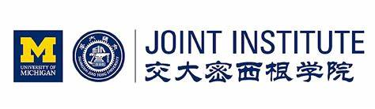

# 交大密院Deep Learning学习手册 
# UM-SJTU-JI Deep learning Hands-on Tutorial

Please find the hands-on tutorials of different sessions in corresponding markdown files. (e.g. Session_1.md)

# Session 0: 在开始写代码之前，分享一些学习资源

Before you start to code, this session is about some recommended resources to start Deep Learning.

## Table of Contents

- [Books](#books)
- [Online Courses](#online-courses)
- [Tutorials and Blogs](#tutorials-and-blogs)
- [Research Papers](#research-papers)
- [YouTube Channels](#youtube-channels)
- [Websites](#websites)
- [Podcasts](#podcasts)

---

## Online Courses

1. **MIT Introduction to Deep Learning （Strongly Recommended! If you only have time for only one tutorial, please watch this one）**
   - A free course offered by MIT.
   - [Link to Course](http://introtodeeplearning.com/)

2. **Deep Learning Specialization by Andrew Ng on Coursera**
   - Covers the foundations and advanced topics in deep learning.
   - [Link to Course](https://www.coursera.org/specializations/deep-learning)

3. **Fast.ai Courses**
   - Practical deep learning courses for coders.
   - [Link to Course](https://www.fast.ai/)

---

## Books

1. **Deep Learning by Ian Goodfellow, Yoshua Bengio, and Aaron Courville （Strongly Recommended!）** 
   - A comprehensive book that provides both theory and practical examples.
   - [Link to Book](http://www.deeplearningbook.org/)

2. **Python Machine Learning by Sebastian Raschka and Vahid Mirjalili**
   - Great for beginners and covers various machine learning techniques along with deep learning.
   - [Link to Book](https://sebastianraschka.com/books.html)

3. **Hands-On Machine Learning with Scikit-Learn, Keras, and TensorFlow by Aurélien Géron**
   - A very practical guide to understanding machine learning with Python libraries.
   - [Link to Book](https://www.oreilly.com/library/view/hands-on-machine-learning/9781492032632/)

4. **Neural Networks and Deep Learning by Michael Nielsen**
   - An online book that is available for free.
   - [Link to Book](http://neuralnetworksanddeeplearning.com/)
  
5. **李沐 动手学深度学习 （Strongly Recommended!）**
   - Book + code + Chinese available.
   - [Link to Book](https://zh-v2.d2l.ai/)
  

---

## Tutorials and Blogs

1. **Towards Data Science on Medium**
   - Various articles, tutorials, and guides on machine learning and deep learning.
   - [Link to Medium](https://towardsdatascience.com/)

2. **Colah's Blog**
   - Provides intuitive explanations for complex topics in deep learning.
   - [Link to Blog](https://colah.github.io/)

3. **Distill.pub**
   - Offers clear and interactive research publications.
   - [Link to Website](https://distill.pub/)
  
4. **Pytorch Official Turorial (Strongly Recommended!)**
   - OFFICIAL hands-on tutorial by Pytorch, if you success with this tutorial, you can skip the session 1 and session 2 in UM SJTU JI tutorial.
   - [Link to Website](https://pytorch.org/tutorials/beginner/deep_learning_60min_blitz.html)
  
   

---

## Research Papers

1. **Batch Normalization: Accelerating Deep Network Training by Reducing Internal Covariate Shift**
   - [Link to Paper](https://arxiv.org/abs/1502.03167)

2. **ResNet: Deep Residual Learning for Image Recognition**
   - [Link to Paper](https://arxiv.org/abs/1512.03385)

3. **Transformers: Attention Is All You Need**
   - [Link to Paper](https://arxiv.org/abs/1706.03762)

---

## YouTube Channels

1. **3Blue1Brown**
   - Excellent channel for visualizing complex topics.
   - [Link to Channel](https://www.youtube.com/c/3blue1brown)

2. **Two Minute Papers**
   - Summarizes research papers in about two minutes.
   - [Link to Channel](https://www.youtube.com/c/K%C3%A1rolyZsolnai)

---

## Websites

1. **arXiv.org**
   - Open-access archive for scholarly articles.
   - [Link to Website](https://arxiv.org/)

2. **Kaggle**
   - Offers various datasets and competitions to practice your skills.
   - [Link to Website](https://www.kaggle.com/)
  
3. **Grand-challenge**
   - Offers various datasets and competitions for medical AI.
   - [Link to Website](https://grand-challenge.org/)

---

## Podcasts

1. **Data Skeptic**
   - Covers topics in data science and machine learning.
   - [Link to Podcast](https://dataskeptic.com/)

2. **The AI Podcast by Lex Fridman**
   - Deep, thoughtful interviews with leaders in the field of AI.
   - [Link to Podcast](https://lexfridman.com/ai/)

---

This is by no means an exhaustive list but should serve as a good starting point for diving into the field of deep learning.

##
© This github repo is maintained by [Yutong Ban 班雨桐 @JI](https://people.csail.mit.edu/yban/index.html), Chongye Yang 杨崇烨 @JI, [Kunyi Yang 杨坤燚 @JI](https://github.com/yangkunhi), Junjie Liu 刘俊杰 @ JI.  
